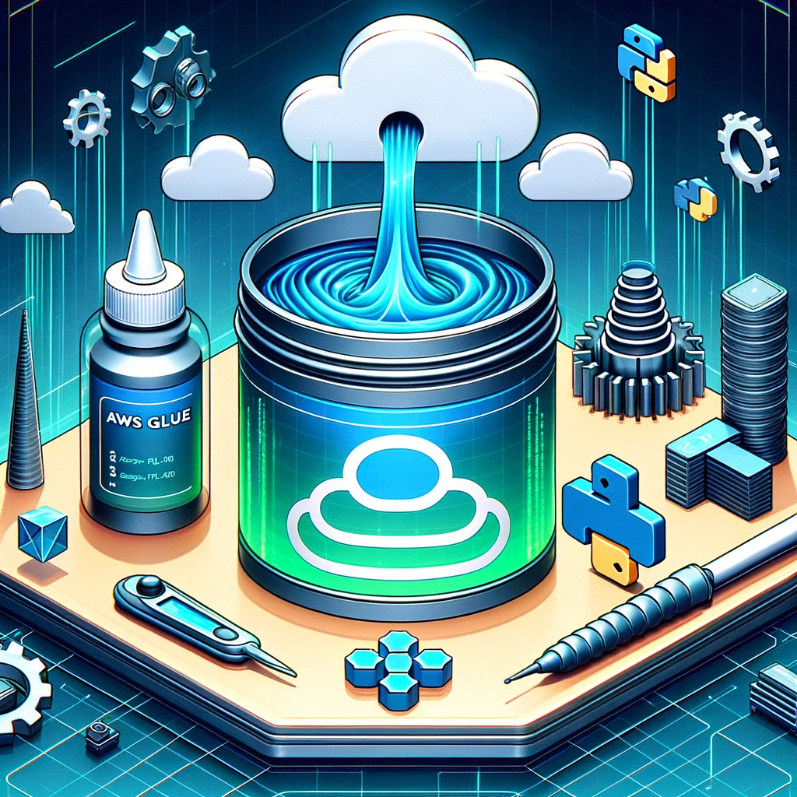

# COMPANY DATA LAKE MANAGEMENT SYSTEM

This repository hosts a comprehensive suite of Terraform configurations and scripts for establishing and managing a sophisticated AWS Glue and data lake infrastructure on AWS. It also encompasses Python and Go scripts for efficient creation and administration of company-specific AWS resources.

## Repository Structure

- `main.tf`: The principal Terraform configuration file. It initializes AWS Glue, sets up necessary IAM roles, and configures the data lake.
- `variables.tf`: This file declares variables for the Terraform configurations.
- `outputs.tf`: Outlines the expected outputs from the Terraform setup.
- `terraform.tfvars`: Utilized for assigning values to the variables declared in `variables.tf`.
- `modules/`: Contains modular configurations for AWS Glue, IAM roles, and data lake setups. Each module includes its respective `main.tf`, `variables.tf`, and `outputs.tf`.
- `scripts/`: Houses Python and Go scripts for company creation and AWS resources management.

## AWS Glue Configuration

The AWS Glue configuration involves the establishment of a Glue database, two Glue crawlers for the intermediary (silver) and refined (gold) data lakes, alongside two Glue jobs. These jobs, implemented as Python scripts and stored in an S3 bucket, perform data transformations within the silver lake and subsequently transfer the processed data to the gold lake.

## Data Lake Setup

This module orchestrates the creation of two S3 buckets: one for the primary data lake storage and another for hosting the Glue scripts. It incorporates a lifecycle policy for the data lake's S3 bucket, transitioning data to the STANDARD_IA storage class after 30 days and scheduling data deletion post 365 days.

## Implementation Instructions

1. Clone the repository to your local environment.
2. Change directory to the project's root folder.
3. Execute `terraform init` for project initialization.
4. Utilize `terraform plan` to review impending modifications.
5. Deploy the configuration with `terraform apply`.

Ensure your environment is configured with the appropriate AWS credentials before executing these Terraform commands.

## Auxiliary Scripts

The Python and Go scripts located in the `scripts/` directory facilitate additional functionalities. They are independent of the Terraform configurations and should be executed as per specific requirements. The Python scripts are designed for data transformation processes in the silver lake, while the Go scripts are tailored for company creation and AWS resource management. Dependencies for these scripts are detailed in the `requirements.txt` and `go.mod` files.

## Additional Information

The project configuration includes a `.gitignore` file, ensuring exclusion of Python cache files and virtual environments from version control.